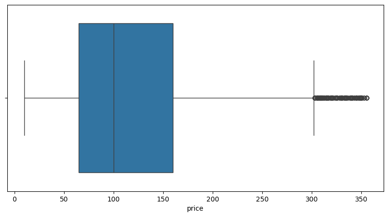
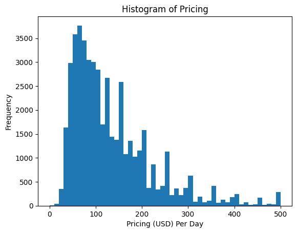
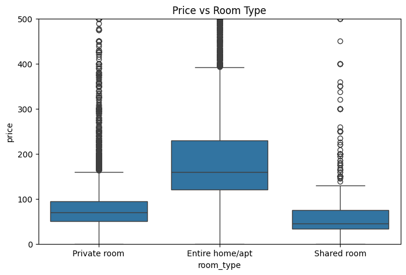
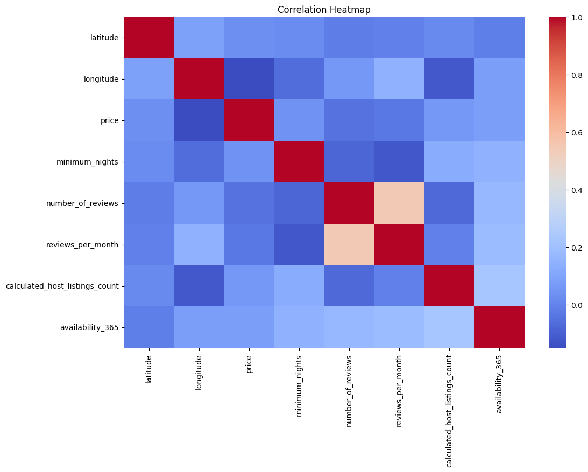
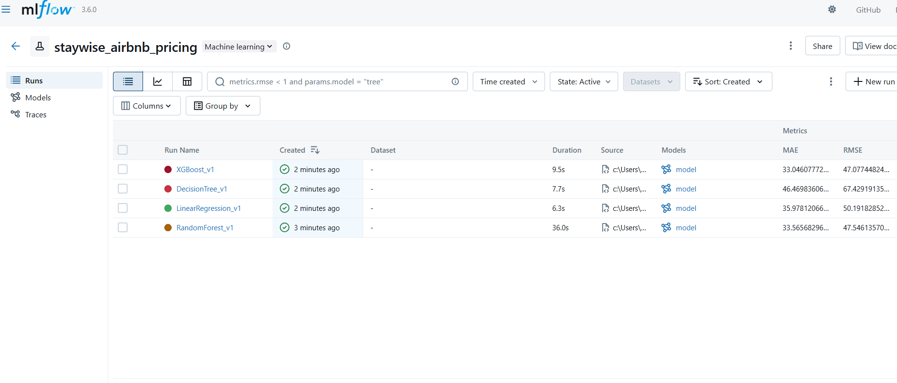
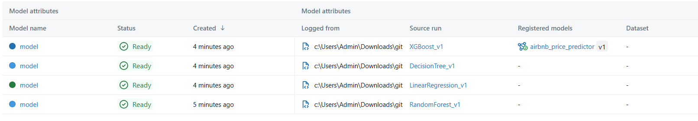

# **Airbnb NYC Price Prediction Machine Learning Project Report**

## **1. Introduction**

This project aims to develop machine learning models to predict the nightly price of Airbnb listings in New York City using the AB_NYC_2019 dataset.

The workflow includes:

- Exploratory Data Analysis (EDA)
- Data Cleaning
- Feature Engineering
- Outlier Treatment
- Categorical Encoding
- Model Training
- Model Evaluation
- Hyperparameter Tuning
- MLflow Experiment Tracking

---

## Project structure

```
StaywiseAirbnbPricingPrediction/
│
├── notebooks/
│ ├── main.ipynb  Main file for model traning
│
├── screenshots/ # Plots, MLflow UI screenshots, results
│
├── requirements.txt # All Python dependencies
├── .gitignore # Ignore venv, data, MLflow artifacts
└── README.md # Full project report & documentation
```

<!-- │ ├── 01_eda.ipynb # Exploratory Data Analysis
│ ├── 02_preprocessing.ipynb # Cleaning, outlier handling & feature engineering
│ ├── 03_model_training.ipynb # Baseline models, comparison, metrics
│ ├── 04_mlflow_experiments.ipynb # MLflow tracking & model registry -->

# **2. Dataset Overview**

**Dataset:** `AB_NYC_2019.csv`
**Rows:** ~49,000
**Columns:** 16

### **Primary Columns Used**

| Type                | Columns                                                                                                                     |
| ------------------- | --------------------------------------------------------------------------------------------------------------------------- |
| **Numerical**       | latitude, longitude, minimum_nights, number_of_reviews, reviews_per_month, calculated_host_listings_count, availability_365 |
| **Categorical**     | neighbourhood_group, neighbourhood, room_type                                                                               |
| **Target variable** | price                                                                                                                       |

---

# **3. Data Cleaning**

### **3.1 Remove Unnecessary Columns**

Dropped columns that do not provide predictive value:

```
id, name, host_name, last_review, host_id
```

### **3.2 Missing Values**

- `reviews_per_month` → filled with **0**
- No other critical numerical missing values

### **3.3 Invalid Values**

- Removed rows where `price <= 0`
- Removed rows where `minimum_nights < 1`

---

# **4. Outlier Detection & Treatment**

Price and minimum_nights had heavy-tailed distributions.

### **Method Used:**

**Upper-bound percentile trimming (95th percentile)**

```python
price_upper = df['price'].quantile(0.95)
mn_upper = df['minimum_nights'].quantile(0.95)

df = df[(df['price'] <= price_upper) &
        (df['minimum_nights'] <= mn_upper)]
```



**Reason:**
Here we remove only extremly high values only because cheap hotels and some luxarious rentals are possible accoding to the services and as per the minimum nights. Also for minimum nights we removes extreme values only as there can be 1 minimum night possible but unrealistic high extremes not possible and also less than 1 is not possible.
Preserves real low values but removes unrealistic high extremes (e.g., $5000/night).

---

# **5. Exploratory Data Analysis (EDA)**

### **5.1 Price Distribution**

- Most prices fall between **$50–$160**
- Long tail on expensive listings



### **5.2 Price vs Room Type**

- Entire home/apt is the most expensive category
- Shared rooms are the cheapest
  

### **5.3 Minimum Nights**

- Majority require **1–5 nights**

### **5.4 Geographic Insight**

NYC areas with higher prices: Manhattan & Brooklyn.

### **5.5 Correlation Heatmap (Numeric Only)**


Main insight:
Latitude/longitude correlate with price (location matters).

---

# **6. Feature Engineering (Basic)**

Added meaningful features:

### **6.1 reviews_ratio**

```python
df['reviews_ratio'] = df['reviews_per_month'] / (df['number_of_reviews'] + 1)
```

### **6.2 is_superhost_like**

```python
df['is_superhost_like'] = (df['calculated_host_listings_count'] > 10).astype(int)
```

### **6.3 availability_category**

```python
# fully_booked / high_demand / medium_demand / low_demand
```

These improved data interpretability.

---

# **7. Categorical Encoding**

- **OneHotEncoding used**
- Fit encoder **only on training data**
- Transform training and test sets separately
- Combined encoded categorical + numeric features

This is done in order to avoid data leakage.

---

# **8. Train/Test Split**

Split the entire dataset into 80-20 split for train and test.

- **80% Training Data**
  Used for model learning + cross-validation.
- **20% Test Data**
  Completely unseen data for final evaluation.

We split so that the model is not evaluated on data it has already seen, preventing overfitting and ensuring realistic performance metrics.

---

# **9. Models Trained**

| Model             | MAE   | RMSE |
| ----------------- | ----- | ---- |
| Linear Regression | ~36   | 50   |
| Decision Tree     | ~46   | 67   |
| Random Forest     | ~33.6 | 47.5 |
| XGBoost           | ~33.0 | 46.9 |

Metrices Used for evaluation of models:

- **MAE (Mean Absolute Error)**
- **RMSE (Root Mean Squared Error)**

I choose these because,

- It project aims to predict price which is continuous value and both are used to evaluate regression problems.

### **Best model: XGBoost / Random Forest (similar performance)**

Random forest and XGBoost showed better performance, mostly similar.

I choosed XGBoost as best model.

# **10. MLflow Tracking**

Logged for each model:

- MAE
- RMSE
- Parameters
- Model artifacts
- Plots (true vs predicted, residuals, feature importance)

- Each model run was logged as an **MLflow experiment run**
- Parameters, metrics, and artifacts (plots) were stored
- The best model was registered in the **MLflow Model Registry**
- MLflow UI was used to compare all experiments visually

### **MLflow UI:**

Used to compare models and identify best-performing model.



### **Model Registry:**

Registered **XGBoost_best** as the production model.



---

# **11. Conclusion**

- **Goal:** Predict Airbnb listing prices
- **Best Model:** XGBoost (MAE ~32.9)
- **Key Contributors:**

  - Room type
  - Latitude/longitude
  - Neighborhood
  - Minimum nights
  - Host listing count

# Setup Instructions:

## 🛠️ 1. Create Virtual Environment

```bash
python -m venv venv
venv\Scripts\activate
```

---

## 📦 2. Install Dependencies

Run below command to install required packages:

```bash
pip install -r requirements.txt
```

---

## 🧪 4. Run Jupyter Notebooks

```bash
jupyter notebook
```
